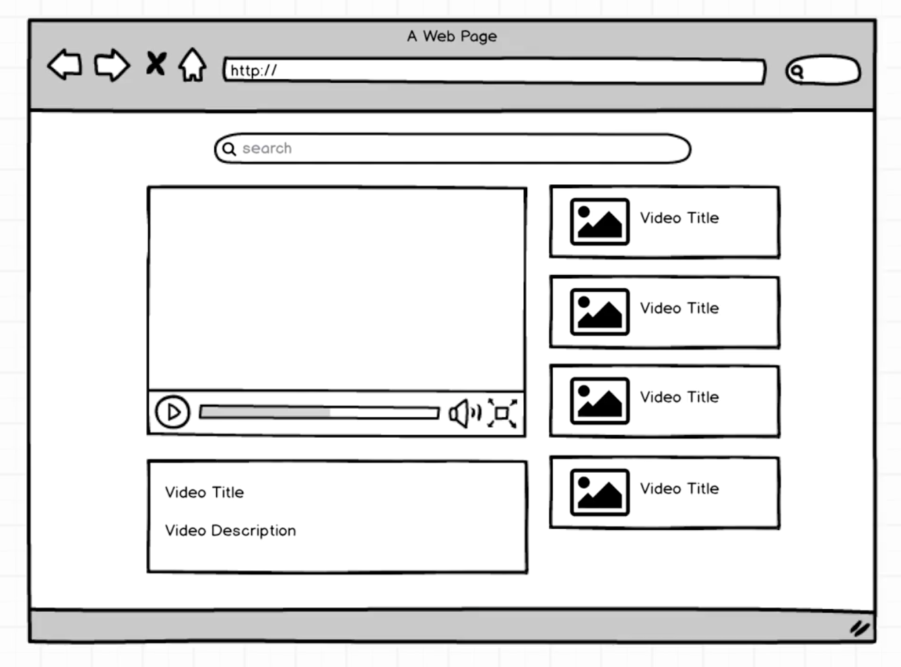

# A YouTube Clone built with React and Redux
This project was developed to learn React and Redux. I incorporated a YouTube API to search YouTube for the users intended searches. The search terms return the first five videos from YouTube, with the main video defaulting to the first of the search results.

###### Technologies Used:
* React
* Redux
* Babel
* Webpack
* YouTube API
* Node
* CSS
* Bootstrap

####  Objectives:
- Page should initially load on a default value.
- Main video should display the title and video description below the player.
- User should be able to type a search value in an input field.
- Page should render with the top five videos returned using the YouTube API and input field value.
- The first video in the search results should be set as the default value.
- User should be able to click on one of the thumbnails, changing the main video being displayed.

### Project Mockup:
A basic mockup of the YouTube clone. 

### YouTube Replica
Functionality and basic styling of the YouTube clone completed.

